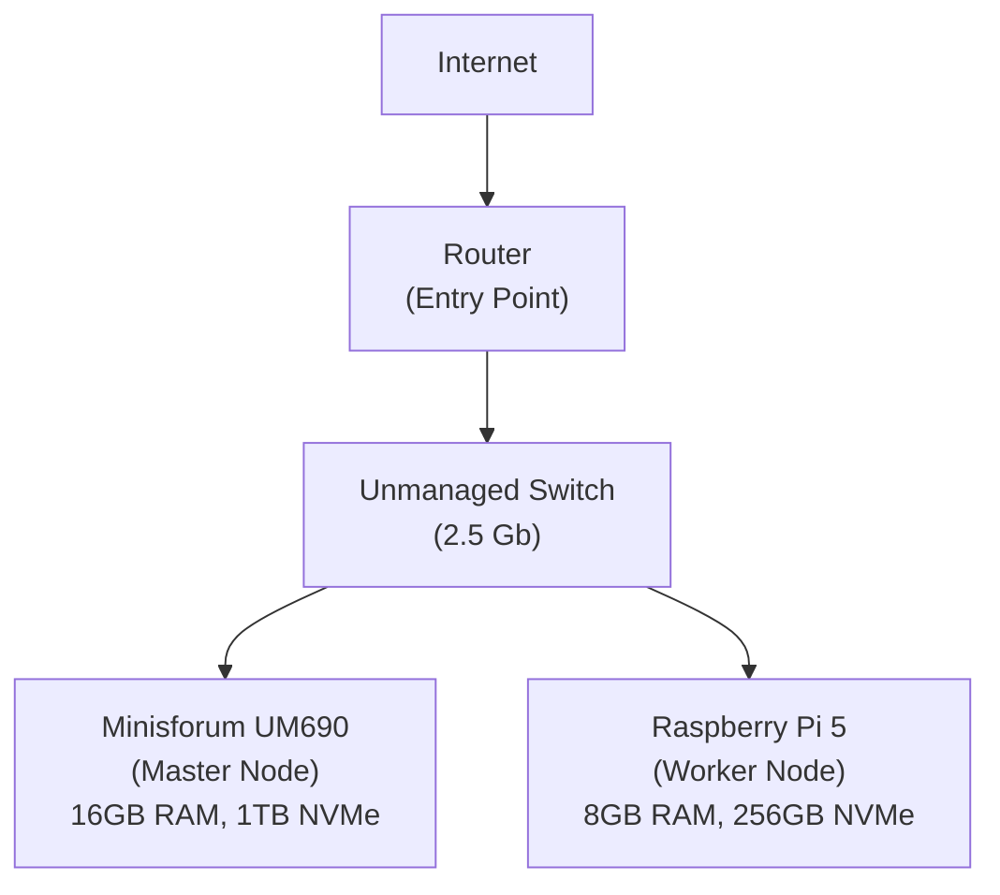

## Hardware

Minisforum UM690: 
- 16GB RAM
- 1T NVMe
- Ubuntu Server

Raspberry Pi 5: 8GB RAM, 256 gb NVMe 
Unmanaged Switch net switch 2.5 gb

## Architecture




### Cluster Setup

Minisforum -  Master node:
```bash
curl -sfL https://get.k3s.io | sh -s - server   --cluster-init   --disable=servicelb   --disable=traefik
```

Raspberry pi - Worker node:
```bash
curl -sfL https://get.k3s.io |   K3S_URL=https://MASTER_IP:6443   K3S_TOKEN=MY_COOL_TOKEN   sh -
```

- `--cluster-init`: Enables HA cluster with embedded etcd database
- `--disable=servicelb`: Allows MetalLB deployment for better load balancing
- `--disable=traefik`: Enables custom ingress controller choice (NGINX, etc.)

### OS changes:

I have disabled the swap for the nodes (`sudo swapoff -a`). For the minisforum:
```bash
sudo swapoff -a
sudo nano /etc/fstab
# comment this line:
# /swap.img	none	swap	sw	0	0
```

For the Raspberry:
```bash
sudo dphys-swapfile swapoff
sudo nano /etc/dphys-swapfile
# set:
CONF_SWAPSIZE=0
sudo systemctl disable dphys-swapfile
# or remove it:
sudo apt remove --purge dphys-swapfile

```

For the raspberry enable the cgroups in the `/boot/firmware/cmdline.txt` file by adding `cgroup_memory=1 cgroup_enable=memory` at the end of the line

## Secrets

This homelab uses [Sealed Secrets](https://github.com/bitnami-labs/sealed-secrets) for secure secret management in GitOps.

### Usage

Install kubeseal: `brew install kubeseal` (macOS) or download from GitHub releases.

#### Using the Makefile (Recommended)

```bash
# 1. Create a plain secret file
kubectl create secret generic mysecret --from-literal=password=mypass --dry-run=client -o yaml > secret.yaml

# 2. Encrypt using the Makefile
make encrypt INPUT=secret.yaml OUTPUT=infrastructure/configs/sealed-mysecret.yaml

# 3. Clean up the plain secret
rm secret.yaml

# 4. Validate the sealed secret (optional)
make validate-sealed INPUT=infrastructure/configs/sealed-mysecret.yaml

# 5. Add to kustomization and commit
```

#### Manual kubeseal commands

```bash
# 1. Create and seal a secret
kubectl create secret generic mysecret --from-literal=password=mypass --dry-run=client -o yaml > secret.yaml
kubeseal --format yaml --controller-namespace flux-system --controller-name sealed-secrets-controller < secret.yaml > infrastructure/configs/sealed-mysecret.yaml
rm secret.yaml

# 2. Add to kustomization and commit
# 3. Flux automatically deploys and decrypts the secret
```

**Important**: Never commit plain text secrets. Sealed secrets are namespace/name specific and can only be decrypted by the target cluster.

### Decrypting Sealed Secrets

For debugging or recovery purposes, you can decrypt sealed secrets back to plain text:

```bash
# 1. Extract the private key from the cluster
kubectl -n flux-system get secret sealed-secrets-keyxs4cs -o go-template='{{ index .data "tls.key" }}' | base64 -d > private.key

# 2. Decrypt the sealed secret
kubeseal --recovery-unseal --recovery-private-key private.key --format yaml < path/to/sealed-secret.yaml > decrypted-secret.yaml

# 3. Clean up the private key (important for security)
rm private.key
```

**Warning**: Handle private keys with extreme care and never commit them to version control.


