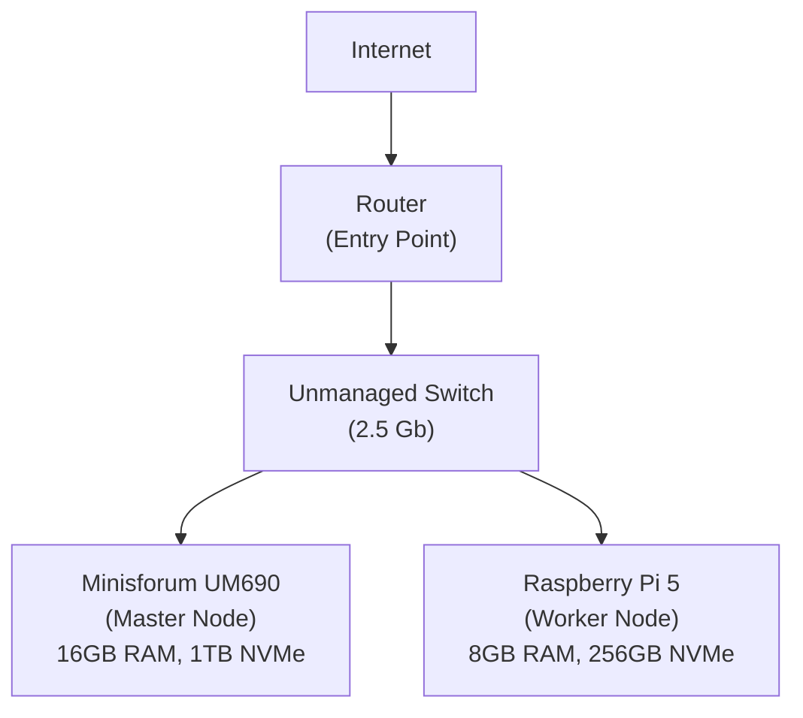

## Hardware

Minisforum UM690: 
- 16GB RAM
- 1T NVMe
- Ubuntu Server

Raspberry Pi 5: 8GB RAM, 256 gb NVMe 
Unmanaged Switch net switch 2.5 gb

## Architecture




### Cluster Setup

Minisforum -  Master node:
```bash
curl -sfL https://get.k3s.io | sh -s - server   --cluster-init   --disable=servicelb   --disable=traefik
```

Raspberry pi - Worker node:
```bash
curl -sfL https://get.k3s.io |   K3S_URL=https://MASTER_IP:6443   K3S_TOKEN=MY_COOL_TOKEN   sh -
```

- `--cluster-init`: Enables HA cluster with embedded etcd database
- `--disable=servicelb`: Allows MetalLB deployment for better load balancing
- `--disable=traefik`: Enables custom ingress controller choice (NGINX, etc.)

### OS changes:

I have disabled the swap for the nodes (`sudo swapoff -a`). For the minisforum:
```bash
sudo swapoff -a
sudo nano /etc/fstab
# comment this line:
# /swap.img	none	swap	sw	0	0
```

For the Raspberry:
```bash
sudo dphys-swapfile swapoff
sudo nano /etc/dphys-swapfile
# set:
CONF_SWAPSIZE=0
sudo systemctl disable dphys-swapfile
# or remove it:
sudo apt remove --purge dphys-swapfile

```

For the raspberry enable the cgroups in the `/boot/firmware/cmdline.txt` file by adding `cgroup_memory=1 cgroup_enable=memory` at the end of the line
